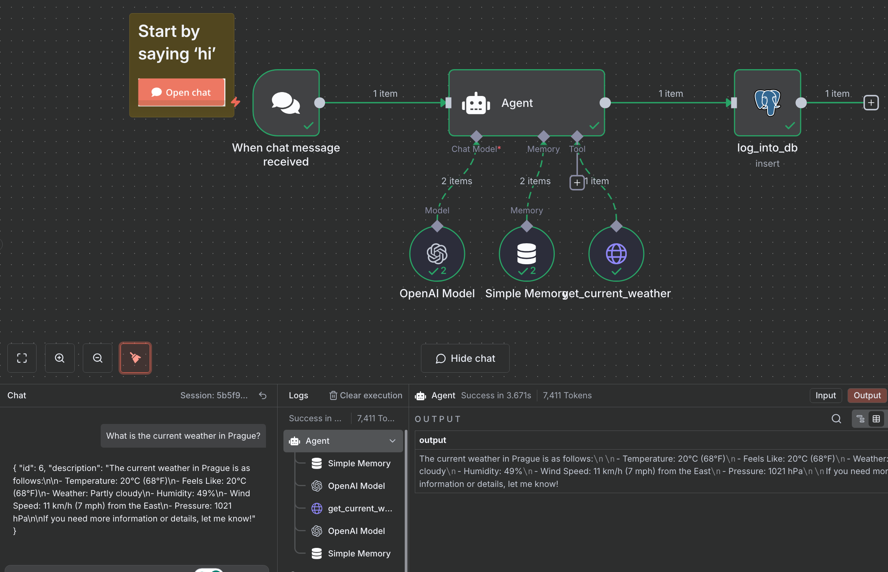

### Run a solution

- Start PostreSQL
```shell
docker run --name pg17-ai-agents \
  -e POSTGRES_USER=postgres \
  -e POSTGRES_PASSWORD=postgres \
  -e POSTGRES_DB=04-n8n \
  -p 5432:5432 -d postgres:17
```

- Create log table
```shell
docker exec -i pg17-ai-agents psql -U postgres -d    <<'SQL'
CREATE TABLE log (
    id SERIAL PRIMARY KEY,
    description VARCHAR(4000)
);
SQL
```

- Import `04-n8n.json` into n8n
- Enter chat message `What is the current weather in Prague?`
  
- Verify there is a log message in the table
```shell
docker exec -it pg17-ai-agents psql -U postgres -d 04-n8n -c "SELECT * FROM log;"
```
```
 id |                      description                      
----+-------------------------------------------------------
  6 | The current weather in Prague is as follows:         +
    |                                                      +
    | - Temperature: 20°C (68°F)                           +
    | - Feels Like: 20°C (68°F)                            +
    | - Weather: Partly cloudy                             +
    | - Humidity: 49%                                      +
    | - Wind Speed: 11 km/h (7 mph) from the East          +
    | - Pressure: 1021 hPa                                 +
    |                                                      +
    | If you need more information or details, let me know!
(1 row)
```

