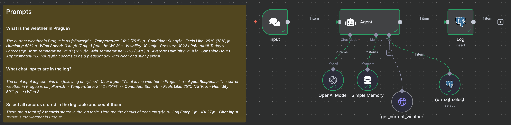

### Run a solution

- Start PostreSQL
```bash
docker network create ai-agents-net
```
```bash
docker run --name pg17-ai-agents \
  --network ai-agents-net \
  -e POSTGRES_USER=postgres \
  -e POSTGRES_PASSWORD=postgres \
  -e POSTGRES_DB=04-n8n \
  -p 5432:5432 -d postgres:17
```

- Create log table
```bash
docker exec -i pg17-ai-agents psql -U postgres -d 04-n8n   <<'SQL'
CREATE TABLE log (
    id SERIAL PRIMARY KEY,
    chat_input VARCHAR(4000),
    agent_response VARCHAR(4000),
    when_created TIMESTAMPTZ DEFAULT CURRENT_TIMESTAMP
);
SQL
```

- Start n8n
```bash
docker run -d --name n8n \
  --network ai-agents-net \
  -p 5678:5678 \
  -v n8n_data:/home/node/.n8n \
  docker.n8n.io/n8nio/n8n
```
  - http://localhost:5678/api/v1/docs/
  - http://localhost:5678/
  - Import `04-n8n.json` into n8n
  - Define secret
    - hostname: `pg17-ai-agents` // or IP returned by `SELECT inet_server_addr();` 
  - Enter chat message `What is the current weather in Prague?`
  
- Verify there is a log message in the table
```shell
docker exec -it pg17-ai-agents psql -U postgres -d 04-n8n -c "SELECT * FROM log;"
```
```
 id |                         chat_input                         |                                         agent_response                                          |         when_created          
----+------------------------------------------------------------+-------------------------------------------------------------------------------------------------+-------------------------------
 27 | What is the weather in Prague.                             | The current weather in Prague is as follows:                                                   +| 2025-09-18 21:53:55.567213+00
    |                                                            |                                                                                                +| 
    |                                                            | - **Temperature:** 24°C (75°F)                                                                 +| 
    |                                                            | - **Condition:** Sunny                                                                         +| 
...
```

