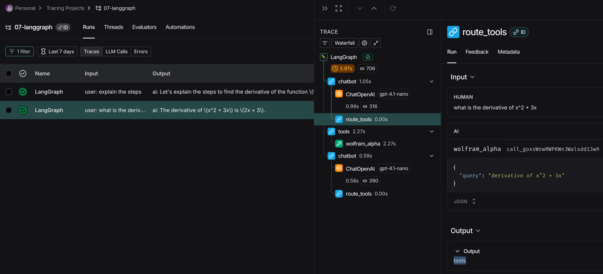

# ReAct agent in Langgraph
- Based on `6-langchain_langgraph/2_langgraph/5_agent/1_react_semi_manual`.
- Fixes `WolframAlphaAPIWrapper`.
- Uses conversation history across all user inputs.
- Shows trace in LangSmith.

## Setup

1. Copy `.env.example` to `.env` and populate the keys:
   ```bash
   cp .env.example .env
   ```
   - `OPENAI_API_KEY`: standard OpenAI key for `gpt-4.1-nano`.
   - `TAVILY_API_KEY`: available from https://app.tavily.com.
   - `WOLFRAM_ALPHA_APPID`: create an AppID in the Wolfram|Alpha developer portal (see below).
   - `LANGSMITH_API_KEY`: (optional) for LangSmith tracing and monitoring (see below).

2. To create a Wolfram Alpha AppID:
   - Sign in at https://developer.wolframalpha.com/portal/myapps.
   - Click **+ Create App** and pick **Wolfram Alpha API** (the full results API) from the product drop-down.
   - After creating the app, copy the generated **AppID** into your `.env` file as `WOLFRAM_ALPHA_APPID`.

3. To enable LangSmith tracing (optional):
   - Sign up at https://smith.langchain.com.
   - Create an API key from your account settings.
   - LangSmith will automatically trace all LangGraph executions, providing visibility into agent decisions, tool calls, and conversation flow.

## Demo

```bash
‚ùØ uv run main.py 
Prepared 5 tools: ['tavily_search_results_json', 'arxiv', 'get_food', 'python_repl', 'wolfram_alpha']
```

### wolfram_alpha
what is the derivative of x^2 + 3x
```
User: what is the derivative of x^2 + 3x
Routing to tools
Tool calls found: [{'name': 'wolfram_alpha', 'args': {'query': 'derivative of x^2 + 3x'}, 'id': 'call_GbCqgfPOk9XntYXM7bvsddYh', 'type': 'tool_call'}]
Tool response: Assumption: d/dx(x^2 + 3 x) = 2 x + 3 
Answer: d/dx(x^2 + 3 x) = 2 x + 3
Assistant: The derivative of \( x^2 + 3x \) is \( 2x + 3 \).
User: explain the steps
Assistant: Let's go through the steps for finding the derivative of the function \( f(x) = x^2 + 3x \).

### Step 1: Identify each term in the function
The function has two terms:
- \( x^2 \)
- \( 3x \)

### Step 2: Apply the power rule to each term
The power rule states:
\[
\frac{d}{dx} [x^n] = n x^{n-1}
\]

- For \( x^2 \), \( n = 2 \):
\[
\frac{d}{dx} [x^2] = 2 x^{2-1} = 2x
\]

- For \( 3x \), \( 3 \) is a constant multiplied by \( x \), and the derivative of \( x \) is 1:
\[
\frac{d}{dx} [3x] = 3 \times 1 = 3
\]

### Step 3: Combine the derivatives
Add the derivatives of each term:
\[
2x + 3
\]

### Final answer:
The derivative of \( x^2 + 3x \) is **\( 2x + 3 \)**.
User: bye
Goodbye!
```



### tavily_search_results_json
What are the latest updates on LangGraph in 2025?
```
User: What are the latest updates on LangGraph in 2025?
Routing to tools
Tool calls found: [{'name': 'tavily_search_results_json', 'args': {'query': 'latest updates on LangGraph 2025'}, 'id': 'call_jUOolc3aYuKuBmc0i9Gmvmvo', 'type': 'tool_call'}]
Tool response: [{"title": "LangGraph and LangChain Hit 1.0 Alpha: The Future of ...", "url": "https://medium.com/@fahey_james/langgraph-and-langchain-hit-1-0-alpha-the-future-of-agentic-ai-infrastructure-8ea86c7c11c8", "content": "On September 2, 2025, LangChain announced a milestone for developers and enterprises building AI systems: 1.0 alpha releases of both LangGraph and LangChain (in Python and JavaScript). This marks the first time their orchestration framework and higher-level developer API are aligned under stable interfaces — paving the way for production-ready, large-scale agentic applications.\n\n⸻\n\nThe Origins of LangChain [...] • LangChain Expression Language (LCEL): a declarative way to build and test pipelines.\n\n• LangServe: deployment tooling to turn chains into APIs.\n\n• LangSmith: an observability and evaluation platform.\n\nThe company raised venture funding to accelerate growth: a $10M seed round (Benchmark, 2023), a $25M Series A (Sequoia, 2024), and most recently, a $100M Series B (IVP, 2025) — cementing its unicorn status.\n\n⸻\n\nWhat is LangGraph? [...] 2. Stability: The core abstractions are locking in, with GA planned for October 2025.\n\n3. Ecosystem leverage: With integrations across all major AI players, LangChain becomes a neutral foundation for enterprise-scale agent systems.\n\nIn short: it’s the closest thing yet to a “standard runtime” for agentic AI.\n\n⸻\n\nConclusion", "score": 0.8033131}, {"title": "LangChain vs. LangGraph: Building LLM Applications in ...", "url": "https://medium.com/@anil.jain.baba/langchain-vs-langgraph-building-llm-applications-in-2025-de5e31b2ea4d", "content": "In the rapidly evolving landscape of large language model (LLM) development, frameworks like LangChain and LangGraph have become essential tools for developers creating AI-powered applications. As of September 2025, these open-source frameworks — both originating from the LangChain ecosystem — address distinct needs in workflow orchestration, agentic AI, and integration with LLMs. This article provides a comprehensive comparison, drawing on their architectures, features, use cases, examples [...] Sign up\n\nSign in\n\nSign up\n\nSign in\n\nMember-only story\n\n# LangChain vs. LangGraph: Building LLM Applications in 2025\n\nAnil Jain | AI / ML Architect | Data Architect\n\n--\n\nShare\n\n## Introduction:", "score": 0.68318754}]
Assistant: In 2025, significant updates have been announced regarding LangGraph, particularly around its transition to version 1.0 alpha. On September 2, 2025, LangChain announced the release of 1.0 alpha versions for both LangGraph and LangChain in Python and JavaScript. This milestone marks the alignment of their orchestration framework and higher-level developer API under stable interfaces, paving the way for production-ready, large-scale agentic AI applications.

LangGraph's core abstractions are being finalized with a General Availability (GA) planned for October 2025. It aims to serve as a "standard runtime" for agentic AI, functioning as a neutral foundation with integrations across all major AI players, enabling enterprise-scale agent systems.

Furthermore, the ecosystem around LangGraph is growing with features like the LangChain Expression Language (LCEL), LangServe for deployment, and LangSmith for observability and evaluation.

Would you like more detailed insights from the articles?
User: bye
Goodbye!
```
###  arxiv
Find recent papers about transformer architectures
```
User: Find recent papers about transformer architectures
Routing to tools
Tool calls found: [{'name': 'arxiv', 'args': {'query': 'transformer architectures'}, 'id': 'call_7PywtA8aAIS8rdps84vJz9pp', 'type': 'tool_call'}]
Tool response: Published: 2023-08-22
Title: TurboViT: Generating Fast Vision Transformers via Generative Architecture Search
Authors: Alexander Wong, Saad Abbasi, Saeejith Nair
Summary: Vision transformers have shown unprecedented levels of performance in
tackling various visual perception tasks in recent years. However, the
architectural and computational complexity of such network architectures have
made them challenging to deploy in real-world applications with
high-throughput, low-memory requirements. As such, there has been significant
research recently on the design of efficient vision transformer architectures.
In this study, we explore the generation of fast vision transformer
architecture designs via generative architecture search (GAS) to achieve a
strong balance between accuracy and architectural and computational efficiency.
Through this generative architecture search process, we create TurboViT, a
highly efficient hierarchical vision transformer architecture design that is
generated around mask unit attention and Q-pooling design patterns. The
resulting TurboViT architecture design achieves significantly lower
architectural computational complexity (>2.47$\times$ smaller than FasterViT-0
while achieving same accuracy) and computational complexity (>3.4$\times$ fewer
FLOPs and 0.9% higher accuracy than MobileViT2-2.0) when compared to 10 other
state-of-the-art efficient vision transformer network architecture designs
within a similar range of accuracy on the ImageNet-1K dataset. Furthermore,
TurboViT demonstrated strong inference latency and throughput in both
low-latency and batch processing scenarios (>3.21$\times$ lower latency and
>3.18$\times$ higher throughput compared to FasterViT-0 for low-latency
scenario). These promising results demonstrate the efficacy of leveraging
generative architecture search for generating efficient transformer
architecture designs for high-throughput scenarios.

Published: 2020-06-15
Title: Differentiable Neural Architecture Transformation for Reproducible Architecture Improvement
Authors: Do-Guk Kim, Heung-Chang Lee
Summary: Recently, Neural Architecture Search (NAS) methods are introduced and show
impressive performance on many benchmarks. Among those NAS studies, Neural
Architecture Transformer (NAT) aims to improve the given neural architecture to
have better performance while maintaining computational costs. However, NAT has
limitations about a lack of reproducibility. In this paper, we propose
differentiable neural architecture transformation that is reproducible and
efficient. The proposed method shows stable performance on various
architectures. Extensive reproducibility experiments on two datasets, i.e.,
CIFAR-10 and Tiny Imagenet, present that the proposed method definitely
outperforms NAT and be applicable to other models and datasets.

Published: 2023-11-21
Title: Interpretation of the Transformer and Improvement of the Extractor
Authors: Zhe Chen
Summary: It has been over six years since the Transformer architecture was put
forward. Surprisingly, the vanilla Transformer architecture is still widely
used today. One reason is that the lack of deep understanding and comprehensive
interpretation of the Transformer architecture makes it more challenging to
improve the Transformer architecture. In this paper, we first interpret the
Transformer architecture comprehensively in plain words based on our
understanding and experiences. The interpretations are further proved and
verified. These interpretations also cover the Extractor, a family of drop-in
replacements for the multi-head self-attention in the Transformer architecture.
Then, we propose an improvement on a type of the Extractor that outperforms the
self-attention, without introducing additional trainable parameters.
Experimental results demonstrate that the improved Extractor performs even
better, showing a way to improve the Transformer architecture.
Assistant: I found several recent papers on transformer architectures:

1. "TurboViT: Generating Fast Vision Transformers via Generative Architecture Search" (Published: 2023-08-22)
   - Focuses on creating efficient vision transformer architectures using generative architecture search to optimize accuracy and efficiency. The resulting TurboViT shows significant improvements in computational complexity and inference latency.
   
2. "Differentiable Neural Architecture Transformation for Reproducible Architecture Improvement" (Published: 2020-06-15)
   - Discusses a method for improving neural architectures through differentiable transformation, emphasizing reproducibility and stability across datasets like CIFAR-10 and Tiny ImageNet.
   
3. "Interpretation of the Transformer and Improvement of the Extractor" (Published: 2023-11-21)
   - Provides a comprehensive interpretation of the Transformer architecture, including the Extractor component, and proposes improvements that outperform the original self-attention mechanism without adding trainable parameters.

Would you like more details on any specific paper or topic?
User: bye
Goodbye!
```

### get_food
I'm hungry, can you get me some food?
```
User: I'm hungry, can you get me some food?
Routing to tools
Tool calls found: [{'name': 'get_food', 'args': {}, 'id': 'call_W38iiiHxPq9mhZicc3NfNYqm', 'type': 'tool_call'}]
Tool response: Here is your plate of spaghetti üçù
Assistant: Enjoy your spaghetti! If you'd like something else or have any other requests, just let me know.
User: bye
Goodbye!
```

### python_repl
Calculate the fibonacci sequence up to the 10th number using Python
```
User: Calculate the fibonacci sequence up to the 10th number using Python
Routing to tools
Tool calls found: [{'name': 'python_repl', 'args': {'__arg1': 'def fibonacci(n):\n    sequence = []\n    a, b = 0, 1\n    while len(sequence) < n:\n        sequence.append(a)\n        a, b = b, a + b\n    return sequence\n\n# Get the first 10 Fibonacci numbers\nfibonacci(10)'}, 'id': 'call_ixKDxZubhYJVb99hcVcZPXO8', 'type': 'tool_call'}]
Python REPL can execute arbitrary code. Use with caution.
Tool response: 
Assistant: The Fibonacci sequence up to the 10th number is: [0, 1, 1, 2, 3, 5, 8, 13, 21, 34].
User: bye
Goodbye!
```

### All tools used for one prompt
Search for the latest AI news, find a research paper about neural networks, solve x^2 - 4 = 0, get me some food, and use Python to calculate 2^10
```
User: Search for the latest AI news, find a research paper about neural networks, solve x^2 - 4 = 0, get me some food, and use Python to calculate 2^10
Routing to tools
Tool calls found: [{'name': 'tavily_search_results_json', 'args': {'query': 'latest AI news'}, 'id': 'call_022ccJbvOcLEFXcQQXvSBLT3', 'type': 'tool_call'}, {'name': 'arxiv', 'args': {'query': 'neural networks'}, 'id': 'call_xlyF5M0Ceg6otdWxYRyujym2', 'type': 'tool_call'}, {'name': 'get_food', 'args': {}, 'id': 'call_y0GuJ4lVkDfzazj9JvFv2iME', 'type': 'tool_call'}, {'name': 'python_repl', 'args': {'__arg1': '2**10'}, 'id': 'call_cJgqIONmqMBZeyHvpY5oMdvh', 'type': 'tool_call'}]
Python REPL can execute arbitrary code. Use with caution.
Tool response: 
Assistant: I found some recent AI news articles, including advancements in AI and machine learning, and the 2025 AI Index Report highlighting AI's integration into daily life. 

I also found a research paper titled "Lecture Notes: Neural Network Architectures" by Evelyn Herberg, providing an overview of various neural network architectures.

The solution to the equation \( x^2 - 4 = 0 \) is \( x = \pm 2 \).

I got a plate of spaghetti for you!

Lastly, the calculation of \( 2^{10} \) equals 1024.
User: bye
Goodbye!
```
