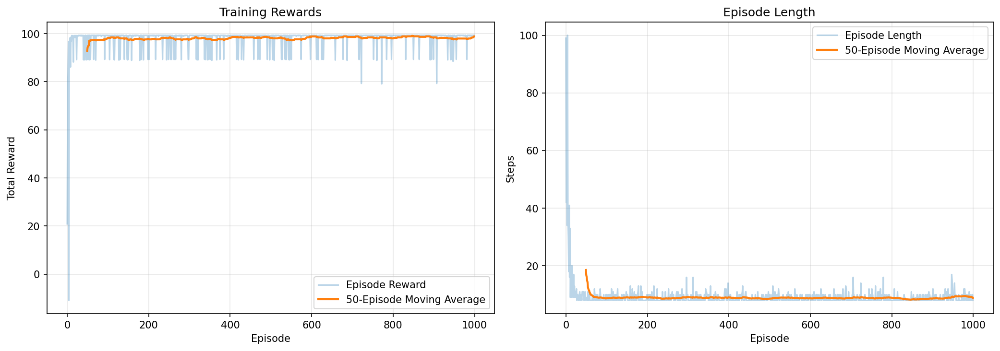

# Q-Learning Grid World with Gymnasium

Q-learning agent implementation for Grid World environment using Gymnasium API.
- Based on `0_Q_learning/2_custom/2_grid` example.
- Adds obstacles into Grid World.
- Generated by Claude Code.

## Environment: Grid World

- **Framework:** Gymnasium (standard RL API)
- **Grid size:** 5×5
- **Start:** Position (0, 0)
- **Goal:** Position (4, 4) - reward +100
- **Obstacles:** 3 randomly placed (seed=42 for reproducibility)
- **Actions:** 4 discrete (0=up, 1=right, 2=down, 3=left)
- **Observations:** Normalized positions [0, 1]

**Rewards:**
- Goal reached: +100.0
- Hit obstacle: -10.0
- Step penalty: -0.1
- Timeout (100 steps): -1.0

## Q-Learning Agent

Q-Learning teaches an agent to navigate by trial and error. The agent maintains a **Q-table** (quality values for each state-action pair) and learns optimal actions through experience.

**Hyperparameters:**
- **Learning rate (α): 0.1** - Controls how much new information overrides old knowledge.
  - *Analogy:* Like studying for an exam
    - α=1.0: Forgets everything (too reactive)
    - α=0.0: Never learns (too stubborn)
    - α=0.1: Gradually updates beliefs (balanced)
  - Lower α = slower, more stable learning. Higher α = faster but more erratic.

- **Discount factor (γ): 0.95** - How much agent values future rewards vs immediate rewards.
  - *Analogy:* Like saving money
    - γ=0.0: Short-sighted ("only care about NOW")
    - γ=1.0: Far-sighted ("future = present")
    - γ=0.95: Realistic ("future important, but slightly less")
  - Higher γ = plans ahead more. Lower γ = greedy for immediate rewards.

- **Exploration rate (ε): 0.1** - How often agent tries random actions (explores) vs best known actions (exploits).
  - *Analogy:* Like choosing a restaurant
    - ε=0.0: Always picks favorite (no exploration)
    - ε=1.0: Always tries random places (no exploitation)
    - ε=0.1: 10% random, 90% favorite (balanced)
  - Higher ε finds better solutions but slower. Lower ε converges faster but may miss optimal paths.

- **Episodes: 1000** - Number of training runs. Agent improves with each episode through trial and error.

**How Learning Works:**
1. **Start episode** - Agent begins at start position
2. **Choose action** - 90% best Q-value, 10% random (exploration vs exploitation)
3. **Execute & observe** - Take action, receive reward, see new state
4. **Update Q-value** - Apply learning formula:
   ```
   Q(s,a) ← Q(s,a) + α[r + γ max Q(s',a') - Q(s,a)]
                     ↑ ↑   ↑─────────────
                     │ │   └─ Discounted future value (γ × best Q from next state)
                     │ └───── Immediate reward
                     └───────── Learning rate
   ```

   **Formula components:**
   - **r**: Immediate reward (what I get RIGHT NOW)
   - **γ max Q(s',a')**: Best discounted future value (what's the best I can do AFTER this action)
     - **s'** (s-prime): Next state after taking action `a` from state `s`
       - Example: Agent at (0,0) moves right → s' = (0,1)
     - **Q(s',a')**: Q-value for next state s' and any action a'
     - **max Q(s',a')**: Maximum Q-value among all actions from state s'
       - Example: If Q(s') = [Up=50, Right=80, Down=60, Left=40] → max = 80

5. **Repeat** - Continue until goal reached or timeout
6. **Next episode** - Reset and train again with updated knowledge

After 1000 episodes, the Q-table becomes an optimal policy for navigating the grid.

## Setup

```bash
uv venv
source .venv/bin/activate
uv sync
```

## Training

```bash
python training.py
```

**Output:**
```
==================================================
GRID WORLD ENVIRONMENT
==================================================
Grid size: 5x5
Start: (0, 0)
Goal: (4, 4)
Obstacles: [(0, 3), (3, 2), (2, 4)]

ACTION SPACE
0=up, 1=right, 2=down, 3=left
==================================================

==================================================
TRAINING Q-LEARNING AGENT
==================================================
Episodes: 1000
Learning rate (α): 0.1
Discount factor (γ): 0.95
Exploration rate (ε): 0.1
==================================================

==================================================
🌟 Episode 1 - START
==================================================
Initial position: (0, 0)
Goal position: (4, 4)

A . . X .
. . . . .
. . . . X
. . X . .
. . . . G

Step 1: Action=up, State=(0, 0), Reward=-0.1
Step 2: Action=right, State=(0, 1), Reward=-0.1
Step 3: Action=up, State=(0, 1), Reward=-0.1
...
Step 79: Action=right, State=(3, 4), Reward=-0.1
Step 80: Action=down, State=(4, 4)
✅ Goal reached in 80 steps! Reward=100.0

==================================================
🌟 Episode 2 - START
==================================================
...

Step 8: Action=down, State=(4, 4)
✅ Goal reached in 8 steps! Reward=100.0

Episode 100/1000 | Avg Reward: 96.68 | Avg Length: 13.43
Episode 200/1000 | Avg Reward: 98.14 | Avg Length: 8.71
Episode 300/1000 | Avg Reward: 97.71 | Avg Length: 9.06
Episode 400/1000 | Avg Reward: 97.83 | Avg Length: 8.86
Episode 500/1000 | Avg Reward: 98.32 | Avg Length: 8.87
Episode 600/1000 | Avg Reward: 97.42 | Avg Length: 9.00
Episode 700/1000 | Avg Reward: 97.53 | Avg Length: 8.83
Episode 800/1000 | Avg Reward: 98.73 | Avg Length: 8.72
Episode 900/1000 | Avg Reward: 98.55 | Avg Length: 8.53
Episode 1000/1000 | Avg Reward: 98.44 | Avg Length: 8.68

==================================================
✅ Training complete! Q-table saved to 'q_table.npy'
==================================================

✅ Training plot saved to 'training_results.png'
```

### Training Results



## Evaluation

```bash
python main.py
```

**Output:**
```
✅ Q-table loaded successfully from 'q_table.npy'
==================================================
GRID WORLD ENVIRONMENT
==================================================
Grid size: 5x5
Start: (0, 0)
Goal: (4, 4)
Obstacles: [(0, 3), (3, 2), (2, 4)]

ACTION SPACE
0=up, 1=right, 2=down, 3=left
==================================================

==================================================
Q-TABLE (State-Action Values)
==================================================
Dimensions: (5 rows × 5 cols × 4 actions)
Actions: Up=0, Right=1, Down=2, Left=3

State (0,0): [58.43 64.97 69.23 56.64]
State (0,1): [12.71  6.41 72.82 12.36]
State (0,2): [-0.1  -1.52 69.74 -0.12]
State (0,3): [0. 0. 0. 0.]
State (0,4): [-0.06 -0.06 -0.06 -1.  ]
State (1,0): [60.83 72.98 24.62 64.05]
State (1,1): [61.84 76.93 57.69 65.51]
State (1,2): [47.3  68.69 81.08 59.36]
State (1,3): [ 1.321e+01  8.000e-02  8.478e+01 -5.000e-02]
State (1,4): [-0.06 -0.06 -3.7   8.67]
State (2,0): [-0.1  50.66 -0.09  0.21]
State (2,1): [ 7.230e+00  1.534e+01  7.723e+01 -7.000e-02]
State (2,2): [66.46 85.45 64.96 52.39]
State (2,3): [64.93 68.36 90.05 74.56]
State (2,4): [0. 0. 0. 0.]
State (3,0): [-0.06 15.09 -0.06 -0.06]
State (3,1): [ 0.92  5.66 84.    0.94]
State (3,2): [0. 0. 0. 0.]
State (3,3): [77.04 94.9  79.78 74.95]
State (3,4): [ 79.44  89.8  100.    79.99]
State (4,0): [-0.04 26.12 -0.05 -0.05]
State (4,1): [11.96 89.66  6.11  3.48]
State (4,2): [ 6.710e+00  9.484e+01  4.452e+01 -1.000e-02]
State (4,3): [ 25.37 100.    24.92  25.88]
State (4,4): [0. 0. 0. 0.]
==================================================

==================================================
🌟 Episode 1 - START
==================================================
Initial position: (0, 0)
Goal position: (4, 4)

A . . X .
. . . . .
. . . . X
. . X . .
. . . . G


State (0,0)
Q-values: Up=58.43 | Right=64.97 | Down=69.23 | Left=56.64
Chosen Action: Down (2)
Step 1: Action=down, State=(1, 0), Reward=-0.1

. . . X .
A . . . .
. . . . X
. . X . .
. . . . G


State (1,0)
Q-values: Up=60.83 | Right=72.98 | Down=24.62 | Left=64.05
Chosen Action: Right (1)
Step 2: Action=right, State=(1, 1), Reward=-0.1

. . . X .
. A . . .
. . . . X
. . X . .
. . . . G


State (1,1)
Q-values: Up=61.84 | Right=76.93 | Down=57.69 | Left=65.51
Chosen Action: Right (1)
Step 3: Action=right, State=(1, 2), Reward=-0.1

. . . X .
. . A . .
. . . . X
. . X . .
. . . . G


State (1,2)
Q-values: Up=47.30 | Right=68.69 | Down=81.08 | Left=59.36
Chosen Action: Down (2)
Step 4: Action=down, State=(2, 2), Reward=-0.1

. . . X .
. . . . .
. . A . X
. . X . .
. . . . G


State (2,2)
Q-values: Up=66.46 | Right=85.45 | Down=64.96 | Left=52.39
Chosen Action: Right (1)
Step 5: Action=right, State=(2, 3), Reward=-0.1

. . . X .
. . . . .
. . . A X
. . X . .
. . . . G


State (2,3)
Q-values: Up=64.93 | Right=68.36 | Down=90.05 | Left=74.56
Chosen Action: Down (2)
Step 6: Action=down, State=(3, 3), Reward=-0.1

. . . X .
. . . . .
. . . . X
. . X A .
. . . . G


State (3,3)
Q-values: Up=77.04 | Right=94.90 | Down=79.78 | Left=74.95
Chosen Action: Right (1)
Step 7: Action=right, State=(3, 4), Reward=-0.1

. . . X .
. . . . .
. . . . X
. . X . A
. . . . G


State (3,4)
Q-values: Up=79.44 | Right=89.80 | Down=100.00 | Left=79.99
Chosen Action: Down (2)
Step 8: Action=down, State=(4, 4)
✅ Goal reached in 8 steps! Reward=100.0

. . . X .
. . . . .
. . . . X
. . X . .
. . . . A


==================================================
Episode 1 finished
Steps: 8
Total Reward: 99.30
==================================================

==================================================
🌟 Episode 2 - START
==================================================
Initial position: (0, 0)
Goal position: (4, 4)

A . . X .
. . . . .
. . . . X
. . X . .
. . . . G


State (0,0)
Q-values: Up=58.43 | Right=64.97 | Down=69.23 | Left=56.64
Chosen Action: Down (2)
Step 1: Action=down, State=(1, 0), Reward=-0.1

. . . X .
A . . . .
. . . . X
. . X . .
. . . . G


State (1,0)
Q-values: Up=60.83 | Right=72.98 | Down=24.62 | Left=64.05
Chosen Action: Right (1)
Step 2: Action=right, State=(1, 1), Reward=-0.1

. . . X .
. A . . .
. . . . X
. . X . .
. . . . G


State (1,1)
Q-values: Up=61.84 | Right=76.93 | Down=57.69 | Left=65.51
Chosen Action: Right (1)
Step 3: Action=right, State=(1, 2), Reward=-0.1

. . . X .
. . A . .
. . . . X
. . X . .
. . . . G


State (1,2)
Q-values: Up=47.30 | Right=68.69 | Down=81.08 | Left=59.36
Chosen Action: Down (2)
Step 4: Action=down, State=(2, 2), Reward=-0.1

. . . X .
. . . . .
. . A . X
. . X . .
. . . . G


State (2,2)
Q-values: Up=66.46 | Right=85.45 | Down=64.96 | Left=52.39
Chosen Action: Right (1)
Step 5: Action=right, State=(2, 3), Reward=-0.1

. . . X .
. . . . .
. . . A X
. . X . .
. . . . G


State (2,3)
Q-values: Up=64.93 | Right=68.36 | Down=90.05 | Left=74.56
Chosen Action: Down (2)
Step 6: Action=down, State=(3, 3), Reward=-0.1

. . . X .
. . . . .
. . . . X
. . X A .
. . . . G


State (3,3)
Q-values: Up=77.04 | Right=94.90 | Down=79.78 | Left=74.95
Chosen Action: Right (1)
Step 7: Action=right, State=(3, 4), Reward=-0.1

. . . X .
. . . . .
. . . . X
. . X . A
. . . . G


State (3,4)
Q-values: Up=79.44 | Right=89.80 | Down=100.00 | Left=79.99
Chosen Action: Down (2)
Step 8: Action=down, State=(4, 4)
✅ Goal reached in 8 steps! Reward=100.0

. . . X .
. . . . .
. . . . X
. . X . .
. . . . A


==================================================
Episode 2 finished
Steps: 8
Total Reward: 99.30
==================================================

==================================================
🌟 Episode 3 - START
==================================================
Initial position: (0, 0)
Goal position: (4, 4)

A . . X .
. . . . .
. . . . X
. . X . .
. . . . G


State (0,0)
Q-values: Up=58.43 | Right=64.97 | Down=69.23 | Left=56.64
Chosen Action: Down (2)
Step 1: Action=down, State=(1, 0), Reward=-0.1

. . . X .
A . . . .
. . . . X
. . X . .
. . . . G


State (1,0)
Q-values: Up=60.83 | Right=72.98 | Down=24.62 | Left=64.05
Chosen Action: Right (1)
Step 2: Action=right, State=(1, 1), Reward=-0.1

. . . X .
. A . . .
. . . . X
. . X . .
. . . . G


State (1,1)
Q-values: Up=61.84 | Right=76.93 | Down=57.69 | Left=65.51
Chosen Action: Right (1)
Step 3: Action=right, State=(1, 2), Reward=-0.1

. . . X .
. . A . .
. . . . X
. . X . .
. . . . G


State (1,2)
Q-values: Up=47.30 | Right=68.69 | Down=81.08 | Left=59.36
Chosen Action: Down (2)
Step 4: Action=down, State=(2, 2), Reward=-0.1

. . . X .
. . . . .
. . A . X
. . X . .
. . . . G


State (2,2)
Q-values: Up=66.46 | Right=85.45 | Down=64.96 | Left=52.39
Chosen Action: Right (1)
Step 5: Action=right, State=(2, 3), Reward=-0.1

. . . X .
. . . . .
. . . A X
. . X . .
. . . . G


State (2,3)
Q-values: Up=64.93 | Right=68.36 | Down=90.05 | Left=74.56
Chosen Action: Down (2)
Step 6: Action=down, State=(3, 3), Reward=-0.1

. . . X .
. . . . .
. . . . X
. . X A .
. . . . G


State (3,3)
Q-values: Up=77.04 | Right=94.90 | Down=79.78 | Left=74.95
Chosen Action: Right (1)
Step 7: Action=right, State=(3, 4), Reward=-0.1

. . . X .
. . . . .
. . . . X
. . X . A
. . . . G


State (3,4)
Q-values: Up=79.44 | Right=89.80 | Down=100.00 | Left=79.99
Chosen Action: Down (2)
Step 8: Action=down, State=(4, 4)
✅ Goal reached in 8 steps! Reward=100.0

. . . X .
. . . . .
. . . . X
. . X . .
. . . . A


==================================================
Episode 3 finished
Steps: 8
Total Reward: 99.30
==================================================

==================================================
EVALUATION SUMMARY
==================================================
Episodes evaluated: 3
Average reward: 99.30
==================================================
```
